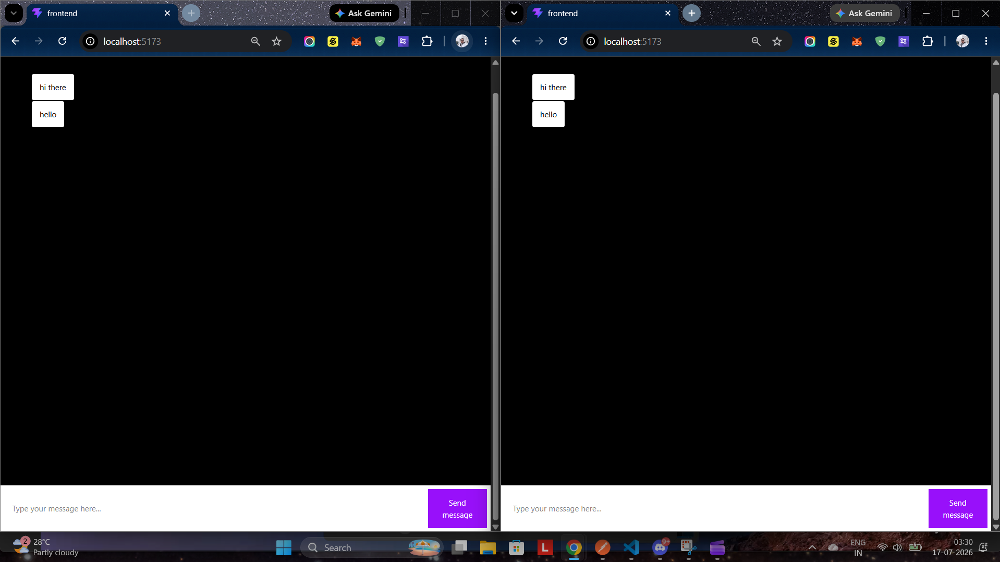

# Echo Chat App

<div align="center">

## Simple Room-Based Chat App


[](https://youtu.be/QyZqO8wyNBA)

▶️ **[Watch Demo Video on Youtube](https://youtu.be/QyZqO8wyNBA)**


A lightweight real-time chat app built with a React + Vite frontend and a Node.js WebSocket backend.

<br/>

[](https://react.dev)
[](https://www.typescriptlang.org)
[](https://vite.dev)
[](https://tailwindcss.com)
[](https://nodejs.org)
[](https://developer.mozilla.org/en-US/docs/Web/API/WebSocket)
[](https://www.npmjs.com/package/ws)
[](./LICENSE)

</div>

---

## What It Does

- Opens a WebSocket connection from the frontend to the backend.
- Joins users into a fixed room (`red`) on connect.
- Broadcasts chat messages to everyone in the same room.
- Renders incoming messages in a simple chat UI.

---

## Tech Stack

- Frontend: React, TypeScript, Vite, Tailwind CSS
- Backend: Node.js, TypeScript, `ws`

---

## Project Structure

```
Echo---Chat-App/
├── Backend/
│   ├── src/index.ts
│   ├── package.json
│   └── tsconfig.json
├── Frontend/
│   ├── src/App.tsx
│   ├── src/main.tsx
│   ├── src/App.css
│   ├── package.json
│   └── vite.config.ts
└── README.md
```

---

## Run Locally

### Backend

```bash
cd Backend
npm install
npm run dev
```

### Frontend

```bash
cd Frontend
npm install
npm run dev
```

> Start the backend first so the frontend can connect to the WebSocket server on port `8080`.

---

## Notes

- The chat flow is intentionally simple and room-based.
- The frontend currently keeps the UI minimal and focuses on message exchange.
- This project is a small learning/demo app rather than a deployed production product.
